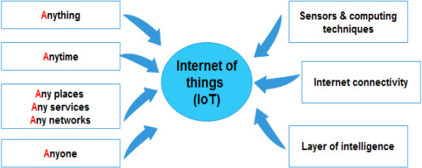

!!! info

    Présentation de ces deux concepts clés et de leur importance dans le monde actuel.

**L'internet des objets (IoT)** a gagné en utilisation et en popularité au cours de la dernière décennie, indiquant de nouvelles orientations productives et passionnantes pour toute une génération de dispositifs d'information. Les concepts fondamentaux de l'IoT ont été inventés par Kevin Ashton en 1999, lorsqu'il a introduit la communication entre appareils à une échelle plus large que celle qui était possible auparavant. Atzori et al. ont depuis déclaré que "l'IoT est le résultat de la convergence de trois visions : ***orientée vers les objets***, ***orientée vers l'internet*** et ***orientée vers la sémantique***". En termes de sémantique spécifiquement, l'IoT est un "réseau mondial d'objets interconnectés". L'IoT peut être défini comme "une infrastructure de réseau mondial dynamique, en tant que telle, elle peut identifier, contrôler et surveiller chaque objet sur terre via l'internet selon un protocole d'accord spécifique, et par l'interconnexion de choses physiques et virtuelles basée sur l'interopérabilité des technologies de l'information et de la communication". L'objectif principal de l'IoT est d'aider à partager des informations en temps réel par le biais d'acteurs autonomes en réseau. La figure 1 explique le concept de l'IoT. Un capteur doté de capacités de calcul intelligentes est placé à un endroit où se trouve une connexion Internet. Ce capteur sera capable de communiquer avec n'importe quoi, à tout moment et de n'importe quel endroit du réseau. Les systèmes de collecte de données localisent et transfèrent les données par le biais d'un grand nombre de ces dispositifs de communication au sein de l'infrastructure IoT, ce qui facilite le processus de collecte des données. Plusieurs solutions de communication, telles que WIFI, ZigBee, Bluetooth et GSM, permettent l'interconnexion de dispositifs utilisant divers réseaux d'accès, notamment l'identification par radiofréquence (RFID), les dispositifs dotés de capteurs sans fil et tout objet intelligent connecté à l'internet par IP physique.

De nos jours, d'énormes volumes de données sont générés par l'IoT. Ces données, souvent appelées **"big data"**, font référence à "une grande échelle de données qui exige de nouvelles architectures et technologies pour la gestion des données (capture et traitement) afin de permettre l'extraction de valeur pour une meilleure compréhension et prise de décision". Le big data se caractérise par diverses propriétés de haut volume, de haute vélocité, de haute variété et de haute véracité. D'ici 2020, l'IoT devrait connecter 50 milliards de dispositifs ou plus, en raison de l'afflux considérable de nouveaux objets intelligents et de l'augmentation exponentielle de la demande de leurs services.

Fig. 1. Internet of things concept.

Récemment, l'IoT a été appliqué dans les environnements intelligents, qui permettent aux utilisateurs de mieux comprendre et contrôler leur environnement grâce à une gamme de dispositifs interconnectés. Dans les applications d'environnement intelligent, l'IoT est employé pour construire un réseau de surveillance écologique complet, à plusieurs niveaux et entièrement couvert, qui peut être réalisé en utilisant l'intégration de capteurs à tous les niveaux en tirant parti de l'IoT avec des informations spatiales et temporelles, et en construisant une plate-forme massive avec un centre de données et un support de service unifié. La technologie IoT et son intégration avec le big data ont été largement appliquées dans divers domaines tels que les villes intelligentes, les soins de santé intelligents, les systèmes d'alerte intelligents et la gestion des catastrophes. Par conséquent, la construction et l'application de l'IoT et du big data dans les domaines environnementaux sont devenues une mesure cruciale, notamment pour le développement, la promotion et la gestion d'un nouvel environnement stratégique dans l'industrie.

